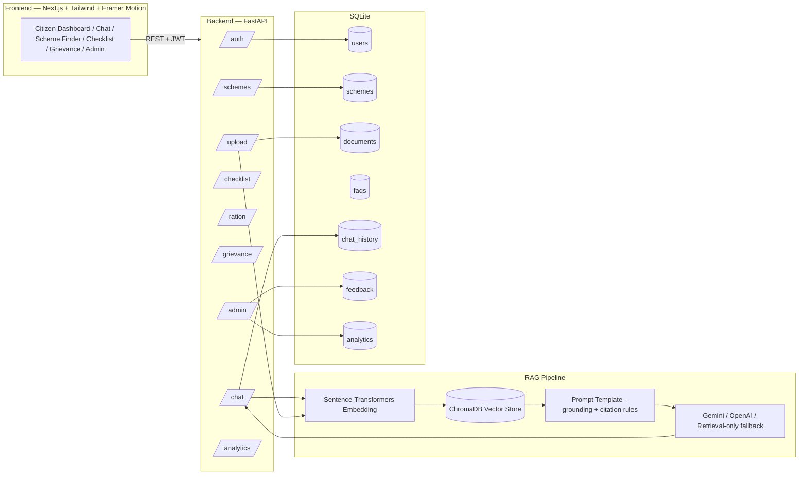
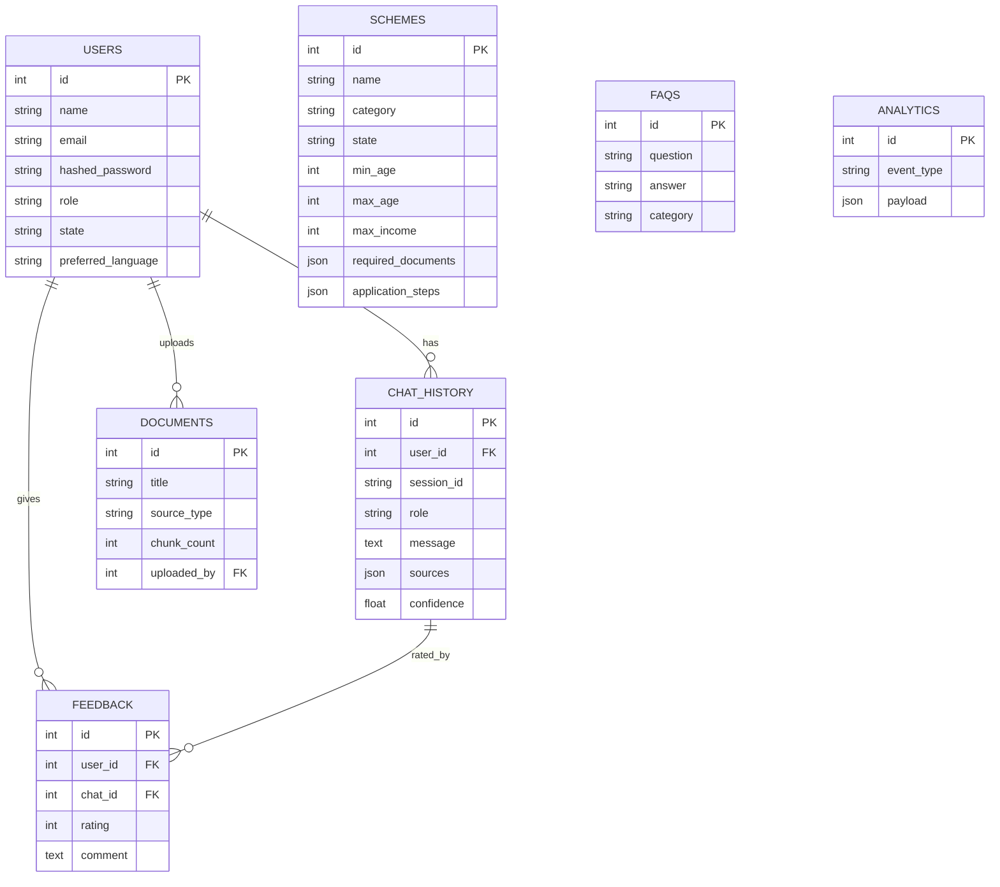
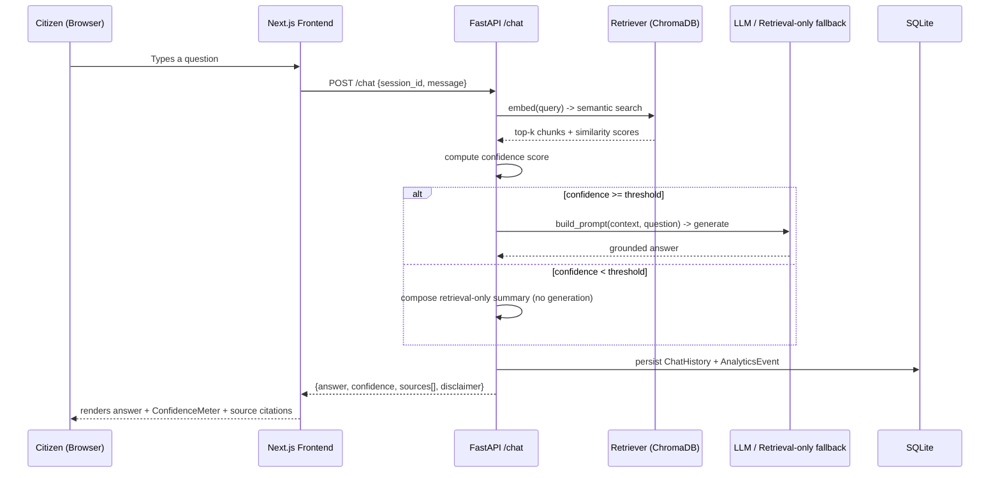
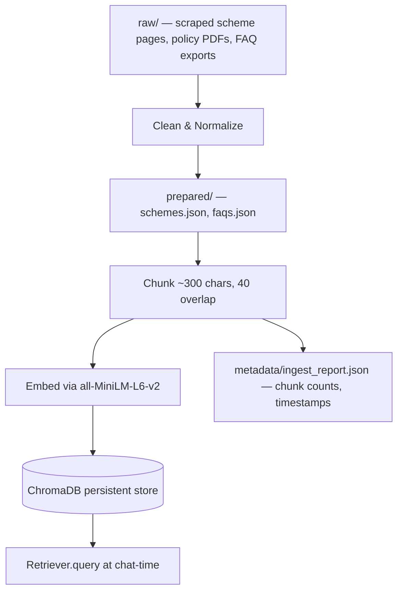

# JanMitra AI — Architecture & Diagrams

## 1. System Architecture

**Why this shape:** the RAG pipeline sits between the API and the vector store so
every citizen-facing endpoint (`/chat`, and indirectly `/schemes`) can be grounded
in the same knowledge base an admin curates through `/upload`. This is what makes
"never hallucinate, always cite sources" enforceable at the architecture level,
not just a prompt instruction.

## 2. Entity-Relationship Diagram

## 3. Sequence Diagram — Chat / RAG Query

## 4. Flow Diagram — Data Pipeline

## 5. Why these architectural choices

| Decision | Reasoning |
|---|---|
| FastAPI over Django/Flask | Async-native, auto-generated OpenAPI docs at `/docs` for live demo, tight Pydantic integration for the strict explainability response schema. |
| SQLite over Postgres for MVP | Zero infra to run/demo; `DATABASE_URL` is swappable to Postgres via SQLAlchemy with no code changes. |
| ChromaDB over Pinecone/Weaviate | Embedded, on-disk, no external service or billing needed for an internship-scale deliverable; same `add/query` interface pattern as hosted vector DBs, so swapping later is low-effort. |
| Retrieval-only fallback in `llm_client.py` | The spec requires zero-hallucination and reliable demoability. Without an API key, the app still returns cited, confidence-scored answers instead of failing. |
| Confidence gating before generation | Prevents the LLM from being asked to answer questions with no supporting context — directly enforces "reject unsupported answers." |
| JWT auth | Stateless, standard, works cleanly across the Next.js frontend and mobile in future. |
| Next.js App Router + Tailwind | Server components where useful, fast iteration, and a design-token-driven Tailwind config keeps the "award-winning UI" requirement consistent across pages instead of ad hoc styling. |
